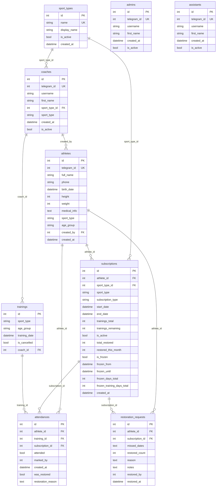

# Схема базы данных FightClubBot

Диаграмма связей таблиц. Можно открыть в VS Code (расширение Mermaid), на GitHub или на [mermaid.live](https://mermaid.live).

## Условные обозначения

- **PK** — первичный ключ  
- **FK** — внешний ключ  
- **UK** — уникальное значение  
- `||--o{` — связь «один ко многим»

## Изолированные таблицы

Таблицы **admins** и **assistants** не связаны внешними ключами с остальными — в них хранятся только telegram_id для проверки прав доступа.
